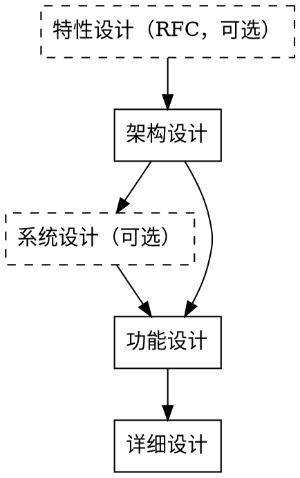
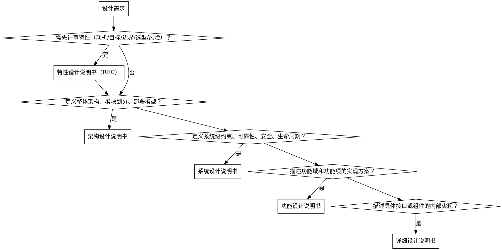

# 设计文档编写

## 目标

按照标准模板编写结构化设计文档，覆盖从特性提案到架构、再到详细实现的完整设计层级。

## 设计流程

自顶向下，上层输出是下层输入：

| 层级 | 文档 | 职责 | 模板 |
|------|------|------|------|
| 0 | 特性设计说明书（RFC，可选） | 在正式设计前提出并评审特性：动机、目标/非目标、用例、总体方案、技术选型、风险与开放问题，用于对齐"做不做、怎么做" | `references/feature-rfc-template.md` |
| 1 | 架构设计说明书 | 定义整体架构、模块划分、逻辑/实现/部署模型、安全分析 | `references/architecture-design-template.md` |
| 2 | 系统设计说明书（可选） | 定义系统级约束（可靠性、安全、生命周期）、专项设计、AI子系统 | `references/system-design-template.md` |
| 3 | 功能设计说明书 | 按功能域和功能项拆分实现方案、接口设计、DFX分析 | `references/function-design-template.md` |
| 4 | 详细设计说明书 | 描述具体接口或组件的内部实现、行为模型、数据模型 | `references/detailed-design-template.md` |

特性设计说明书（RFC）不是必选项。当某个特性需要先经社区/团队评审对齐（动机、边界、技术选型、风险）再进入正式设计时使用；特性较小、无争议时可直接从架构设计开始。系统设计说明书也不是必选项，当系统级约束（可靠性、安全、生命周期等）需要独立成文档时插入，否则相关内容直接写在架构设计说明书中。

## 文档类型选择

## 使用方式

1. 按自顶向下顺序编写：需要时先出特性设计（RFC），再架构，再功能，再详细
2. 根据设计范围选择对应的文档类型和模板
3. 复制模板到项目的 `docs/design/` 目录下，按类型分组，按 `YYYY-MM-DD-<topic>-<type>.md` 命名
4. 逐节填充，模板中的章节不可删除（不涉及的写"不涉及"）
5. 修订记录必须在每次变更后更新

## 编写原则

- **先填元信息**：产品版本&密级、拟制信息、修订记录、关键词、摘要必须在文档开头完成
- **删节留痕**：模板中的章节不可删除，不适用的章节填"不涉及"
- **证据可追溯**：关键设计决策必须关联上游文档或来自可信源的参考文档，项目代码为第一可信源
- **DFX 不省略**：可靠性、安全性、性能等 DFX 分析按实际需要填充，不跳过

## 格式约定

- 模板中的"XXX"可以替换，替换成实际设计内容
- "XXX"可以有并列的多条。如功能项XXX，当实际设计时可以拆分成三个功能项，则有三个并列的功能项标题，每个标题的下属子标题与模板相同
- 由于标题数量可变，模板不设标题编号。但是当完成设计文档时（包括修复、订正等），需要扫描所有标题，插入标题编号
- 缩略语清单写三列：缩略语、英文全称、中文名

## 视图规范与制图约定

设计文档用 4+1 视图表达总-分结构与层级关系，统一用 mermaid 配图。架构设计、功能设计共享同一套设计元素（系统 / 组件 / 模块）和同一套图约定，三类视图各司其职：

- **架构图（框图）**：是设计的第一步，先于其它视图产出。它决定了有哪些设计元素（系统、组件、模块），后续所有视图和模型都必须能在其中找到对应，不得游离其外。用 mermaid `graph TB` 绘制，**必须同时呈现两种结构关系，缺一不可**：
  - **包含关系**（框套框）：用 `subgraph` 嵌套表达——每个组件是一个 `subgraph`，其内部包含的模块是 `subgraph` 里的节点；被包含的模块不得画成与组件平级的独立框，否则包含信息丢失。
  - **依赖关系**（上下位置）：模块 / 组件间的依赖用**自上而下**的有向边表达——依赖方画在上方、被依赖者画在下方（`graph TB` 默认从上到下），箭头方向即依赖方向。上下层级位置不得缺失，也不得随意平铺堆放成无层次的并列框。
  - 系统外部：体现与外部系统的**边界和依赖**。
- **上下文视图（框图）**：在架构图基础上，标出本系统与外部系统之间的**一组逻辑接口**（按职责聚合，而非逐个罗列）。
- **流程图（时序图）**：本 skill 中"流程图"统一指 mermaid `sequenceDiagram`（时序图）。参与者（`participant`）与架构图中的设计元素**一一对应**；参与者之间的消息（`->>`）代表一次**单个逻辑接口**的调用（函数调用、库调用、RESTful API 等都可表示为一条消息）。不得用 `flowchart` / `graph` 替代时序图来表达模块间的交互流程。

三类图共享同一套设计元素。逻辑接口的归属按层级递进，不重叠：架构图只定义元素与结构（包含 / 依赖 / 外部边界），**不承载逻辑接口**；上下文图在此基础上标出**一组聚合的逻辑接口**；时序图再把每个聚合接口拆成若干**单个逻辑接口**消息。例：组件 A 与组件 B 在上下文图中交互的接口是 `IF-DEV-CTRL-API`（按"设备控制"职责聚合成的一组接口，含设备的 CRUD）；而在"创建设备"时序图中，A 调用的是 B 的"创建设备"这一单接口。先有聚合的接口边界（上下文图），再有细分的调用（时序图），两者的数量和职责必须能对得上。

**模型链按顺序对应**：架构图 / 上下文图中的逻辑元素 → 代码模型中的代码元素 → 构建元素（由代码元素一一对应或聚合而成）→ 交付元素（由构建元素一一对应或聚合而成）→ 部署模型中的部署节点。每一层都不得凭空出现上一层无法解释的元素，也不得丢失上一层已经定义的元素。

## 特性设计（RFC）

- 特性设计（RFC 提案）是设计流程的**最上游**：在进入正式设计前，对齐"做不做、为什么做、怎么做、边界在哪、有什么风险"。
- 状态驱动：文档带 `Status`（Draft / Reviewing / Approved / Rejected / Superseded）字段，必须关联 Issue/PR 以便追踪背景；评审通过（Approved）后作为下游架构设计的输入，被取代或拒绝时保留历史。
- 目标与非目标必须写清：用"非目标"显式划定边界，防止需求蔓延。
- 方案设计采用总-分结构：先在"总体方案 / 技术选型"中给出整体设计思路、技术方案、放弃的备选方案及理由（总），再在"功能与性能设计 / 安全隐私与 DFX 设计 / 编程与调用设计"中分节展开（分）。分的内容必须能从总的部分推出，存在逻辑关系，不可生硬堆砌、凭空出现。
- 若涉及可被二次开发的接口，需给出"编程模型基本设计 / 接口定义与设计 / 编程手册设计"；不涉及则在对应章节填"不涉及"。
- 必须给出"缺点和风险"与"未解决问题"：风险要包含 Breaking Change、性能回退、兼容性、迁移成本等并给出应对措施；未解决问题列出需在 RFC 通过前解决的开放项。
- RFC 中的架构图、上下文图、流程图遵循本 skill 的"视图规范与制图约定"；若 RFC 已给出系统设计元素（系统 / 组件 / 模块），下游架构设计必须与之对应、不得无故偏离。

## 架构设计

- 架构设计以整个系统 / 整个组件的 4+1 视图为核心进行扩展。
- 若上游存在已通过的特性设计（RFC），架构设计应承接其总体方案与设计元素，不得无故偏离。
- 架构图是第一步：先画架构图，确定系统边界、组件与模块的包含和依赖关系，产出"逻辑元素清单"；上下文图、流程图、各类模型都从这份清单推理而来。
- 架构设计采用总-分结构：先在"架构和关键质量属性目标 / 架构原则"中给出整体重点、边界与交互形式（总），再在"逻辑架构 / 实现架构"中分层展开结构模型、行为模型、数据模型及代码 / 构建 / 交付 / 部署模型（分）。分的内容必须能从总的部分推出，二者存在明确逻辑关系，不能生硬堆砌、凭空出现。
- 关注项目整体结构、组件间交互、外部系统边界，不关注实现细节。
- 实现架构内的代码模型、构建模型、交付模型、部署模型，严格按"视图规范与制图约定"中的模型链逐层对应、逐层收敛。

## 功能设计

- 功能设计以模块级的 4+1 视图为核心进行扩展。
- 功能设计的架构视图，是架构设计架构视图的 **1 层 / 2 层展开**：把架构设计中的某个组件或模块"打开"，看其内部架构。功能设计中的设计元素必须能在架构设计的架构图中找到来源，两者一一对应、不能脱节。
- 功能设计采用总-分结构：功能域 / 功能项前部先**总述**（面向谁、解决什么问题、核心能力、输入输出、边界、交互形式、收益、风险、验收口径），后部再**分节**展开实现思路、实现设计、接口、DFX、影响点。分的内容由总述推理而来，存在逻辑关系，不可凭空出现。
  - 每个功能域或功能项开头先用通俗易懂、深入浅出的语言突出该功能的重点，而不是直接堆实现细节。
  - 前部优先整理外部视角最关心的点；可用 mermaid 图形或表格辅助说明流程、关系、状态、差异或边界，让读者先建立整体图景。
- 时序图与（展开后的）架构图元素**一一对应**，参与者之间的消息代表模块间的单个逻辑接口；上下文图中聚合的一组接口（如 `IF-DEV-CTRL-API`），在具体功能时序图中拆成创建 / 读取 / 更新 / 删除设备等单接口调用。先定接口边界（上下文图），再画时序。
- **每个功能项的"实现设计"节必须用一张时序图（mermaid `sequenceDiagram`）表现该功能的主要流程**：以该功能涉及的模块 / 组件为参与者，按调用顺序画出主要消息。这是功能设计的硬性要求，不得用纯文字或 `flowchart` 代替；若功能确无可表现的跨模块交互（纯单模块内部逻辑），说明并填"不涉及"。
- 一般情况下，一个功能应由单个模块提供，当超出时，说明功能划分的细粒度不够。
- 功能设计提供逻辑接口定义，用于划分模块之间的边界，定义模块交互模式及内容。
- 功能设计不应关注具体代码实现。可以用伪代码描述相应方案，但不应指定某种特定编程语言。
- 每个功能项，尽量描绘出模块间或者函数间的调用关系或调用路径；如果方案导致了变动，把原始的和修改后的都画出来。

## 详细设计

- 详细设计聚焦功能设计的实现，应能指导特定特性/功能的开发
- 详细设计提供内部接口定义和代码实现参考，可以具体到特定的运行环境、语言特性
