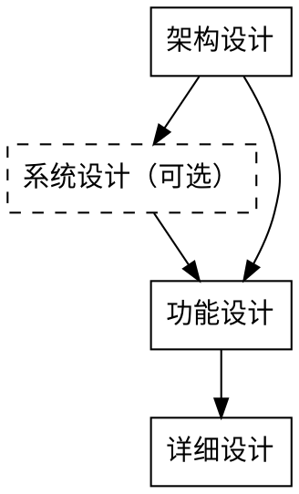
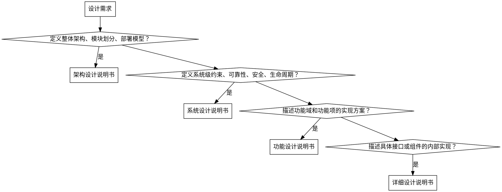

# 设计文档编写

## 目标

按照标准模板编写结构化设计文档，覆盖从架构到详细实现的完整设计层级。

## 设计流程

自顶向下，上层输出是下层输入：

| 层级 | 文档 | 职责 | 模板 |
|------|------|------|------|
| 1 | 架构设计说明书 | 定义整体架构、模块划分、逻辑/实现/部署模型、安全分析 | `references/architecture-design-template.md` |
| 2 | 系统设计说明书（可选） | 定义系统级约束（可靠性、安全、生命周期）、专项设计、AI子系统 | `references/system-design-template.md` |
| 3 | 功能设计说明书 | 按功能域和功能项拆分实现方案、接口设计、DFX分析 | `references/function-design-template.md` |
| 4 | 详细设计说明书 | 描述具体接口或组件的内部实现、行为模型、数据模型 | `references/detailed-design-template.md` |

系统设计说明书不是必选项。当系统级约束（可靠性、安全、生命周期等）需要独立成文档时插入，否则相关内容直接写在架构设计说明书中。

## 文档类型选择

## 使用方式

1. 按自顶向下顺序编写，先架构再功能再详细
2. 根据设计范围选择对应的文档类型和模板
3. 复制模板到项目的 `docs/design/` 目录下，按类型分组，按 `YYYY-MM-DD-<topic>-<type>.md` 命名
4. 逐节填充，模板中的章节不可删除（不涉及的写"不涉及"）
5. 修订记录必须在每次变更后更新

## 编写原则

- **先填元信息**：产品版本&密级、拟制信息、修订记录、关键词、摘要必须在文档开头完成
- **删节留痕**：模板中的章节不可删除，不适用的章节填"不涉及"
- **证据可追溯**：关键设计决策必须关联需求编号或上游文档
- **DFX 不省略**：可靠性、安全性、性能等 DFX 分析按实际需要填充，不跳过

## 格式约定

- 模板中的"XXX"可以替换，替换成实际设计内容
- "XXX"可以有并列的多条。如功能项XXX，当实际设计时可以拆分成三个功能项，则有三个并列的功能项标题，每个标题的下属子标题与模板相同
- 由于标题数量可变，模板不设标题编号。但是当完成设计文档时（包括修复、订正等），需要扫描所有标题，插入标题编号
