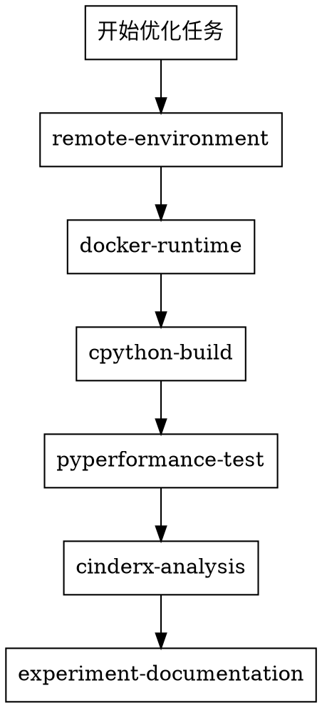

# CPython/CinderX 优化技能引导

本仓库提供 CPython/CinderX 性能优化的系统化工作流。

## 核心原则

- 远程环境默认进入 Docker 容器隔离，不直接在裸机上工作
- 先做项目隔离（宿主机独立目录），再做环境隔离（Docker 容器）
- 先拿可复现证据，再下根因结论
- 用结构化产物沉淀实验结果，避免只留口头结论

## 技能清单

| 技能名 | 触发条件 |
|--------|---------|
| `remote-environment` | 需要连接远程服务器、配置 SSH、创建独立目录 |
| `cpython-build` | 需要编译 CPython 或 CinderX、强制覆盖安装 |
| `docker-runtime` | 需要创建/管理 Docker 容器、挂载目录、镜像复用 |
| `pyperformance-test` | 需要跑 pyperformance benchmark、对比性能数据 |
| `cinderx-analysis` | 需要分析 JIT/非JIT 用例、dump HIR/LIR、定位性能瓶颈 |
| `experiment-documentation` | 需要记录实验结果、写报告、规范产物格式 |
| `design-documentation` | 需要编写系统设计、架构设计、功能设计或详细设计文档 |

## 执行顺序

按需进入，不是每步都必须。用户已有环境时跳过对应步骤。

## Docker 线选择

| 目标 | 选择 |
|------|------|
| 验证 benchmark / 抓 HIR / JIT log / crash | `cinderx-test` |
| stock CPython vs CinderX 正式对照 | `cpython-baseline` |
| Docker 与真实环境差异复核 | 回宿主机 |

## 性能口径

正式对比前先明确口径，不要混用：

| 口径 | 说明 |
|------|------|
| `CPython 解释执行` | stock baseline |
| `CPython JIT` | stock JIT 收益 |
| `CinderX 解释执行` | CinderX 不启 JIT |
| `CinderX JIT` | CinderX 最终加速 |

## baseline 的两种含义

写报告时必须说明 `baseline` 指的是什么：
- **口径基线**：比较 CinderX 和原生 CPython
- **提交基线**：比较改动前后提交

## 快速路由

- 只看功能不看性能 → `cinderx-test` + 单 `run_benchmark.py` + 开 HIR dump
- 复现 crash → 单 `run_benchmark.py --worker` + `jit.log` / HIR
- 正式 benchmark → 先关 HIR dump，用 `python -m pyperformance run`
- 修掉 crash / 找到根因 → 必须写文档（调用 `experiment-documentation`）
